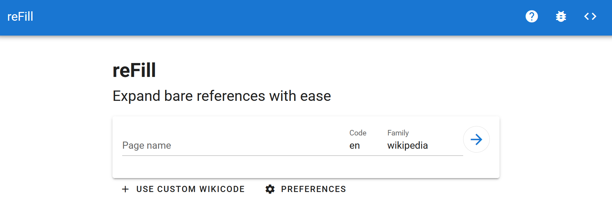

# reFill

**reFill** fixes [bare URLs](https://en.wikipedia.org/wiki/Wikipedia:Bare_URLs) in Wikipedia articles. In other words, it turns refs that look like this...

```
<ref>https://www.bbc.com/culture/article/20260403-the-best-tv-shows-of-2026</ref>
```

into refs that look like this:

```
<ref>{{Cite web|url=https://www.bbc.com/culture/article/20260403-the-best-tv-shows-of-2026|title=10 of the best TV shows of 2026 so far|date=April 7, 2026|website=www.bbc.com}}</ref>
```

ReFill does everything except publish the edit, including setting up an on-wiki diff of the edit for you to review. It is up to you, the user, to check the diff and make sure that the generated citation templates are accurate.

* [Documentation for users](https://en.wikipedia.org/wiki/Wikipedia:ReFill)
* [File bugs and feature requests on Phabricator](https://phabricator.wikimedia.org/maniphest/task/create/?projects=Tool-refill)
* [Talk page](https://en.wikipedia.org/wiki/Wikipedia_talk:ReFill)
* [Discord channel](https://discord.com/channels/221049808784326656/1123258346045198366)

## Front end (https://refill.toolforge.org/)

[](screenshot.png)

Our front end is written in the Vue.js JavaScript framework. It is fairly simple. The first screen asks for a wiki page or wikicode, then the second page loads that wikicode and sends it to the back end (https://refill-api.toolforge.org/) via an API query, then streams the response. The user can then click a button that takes them to Wikipedia to preview an edit containing ReFill's suggested changes.

### Entry points

/result.php, and the entire /ng/ directory, use .lighttpd.conf or PHP to redirect to /ng/index.html, which loads the Vue app, which has been minified by Webpack.

### How to get it running on localhost

```
cd refill.toolforge.org/versions/stable/web/ng
npm install
npm run dev
```

Then visit http://localhost:8087/

You will need to cancel (Ctrl-C) and then re-run `npm run dev` when modifying certain files (such as config.development.js).

### How to deploy

Locally...

```
cd refill.toolforge.org/versions/stable/web/ng
npm install
npm run build
```

Then...

- log into ToolForge
- delete all the files in the /versions/stable/web/ng/ directory
- copy paste the contents of your local /dist/ directory into the /ng/ directory

You will need to hard refresh your browser (Ctrl+F5) when visiting the front end right after a deploy.

There are efforts to write a deploy.sh script at [T422570: create a deploy.sh script for the front end](https://phabricator.wikimedia.org/T422570).

### How to set up ToolForge from scratch again

- Copy over the folder structure and settings files located in this repo's /refill.toolforge.org/ directory.
- Delete the contents of the /ng/ directory, then follow the "How to deploy" directions above.
- SSH into ToolForge and run the following commands to start the webserver:

```
ssh login.toolforge.org
become refill
toolforge webservice status
toolforge webservice stop
toolforge webservice php8.4 start
```

### How to restart if it gets stuck

```
ssh login.toolforge.org
become refill
webservice restart
```

### Third party libraries

* [wikEd diff](https://en.wikipedia.org/wiki/User:Cacycle/diff) - Last updated upstream in 2014. ReFill's copy is lightly modified.

## Back end (https://refill-api.toolforge.org/)

The ReFill API is a REST API running in Flask, a Python framework. It uses Celery and Redis to create asynchronous jobs. It gets information about how to parse each URL from Wikimedia's Citoid, which uses Zotero.

TODO. This section will be updated as part of the ticket [T422439: figure out how to deploy the back end](https://phabricator.wikimedia.org/T422439). See "Links -> Documentation for developers" below for the old documentation on this.

The back end files currently reside in the directory /backend/, but that will eventually be [renamed to /refill-api.toolforge.org/](https://phabricator.wikimedia.org/T422436).

### How to get it running on localhost

TODO

### How to deploy

TODO

### How to set up ToolForge from scratch again

TODO

### How to restart if it gets stuck

```
ssh login.toolforge.org
become refill-api
webservice restart
./restart.sh
```

If that doesn't work, also try...

```
kubectl delete -f worker-deployment.yml
kubectl apply -f worker-deployment.yml
```

## Links

* Documentation for developers:
    * This README.md
    * [README_OLD.md](README_OLD.md)
    * https://en.wikipedia.org/wiki/Wikipedia:ReFill/technical
    * https://en.wikipedia.org/wiki/Wikipedia:Refill/Windows
    * https://en.wikipedia.org/wiki/User:Curb_Safe_Charmer/Refilldev
    * https://en.wikipedia.org/wiki/Wikipedia:Refill/restart
* Other GitHubs:
    * https://github.com/theresnotime/refill
    * https://github.com/zhaofengli/refill-labsconf
    * https://github.com/refill-ng/refill-labsconf
    * https://github.com/theresnotime/refill-labsconf
* Other Toolforges:
    * https://toolsadmin.wikimedia.org/tools/id/refill-api-test
    * https://toolsadmin.wikimedia.org/tools/id/refill-tnt

There is documentation for developers scattered in several different places. We are working on consolidating the most important and up-to-date info from these docs into this one README file.
